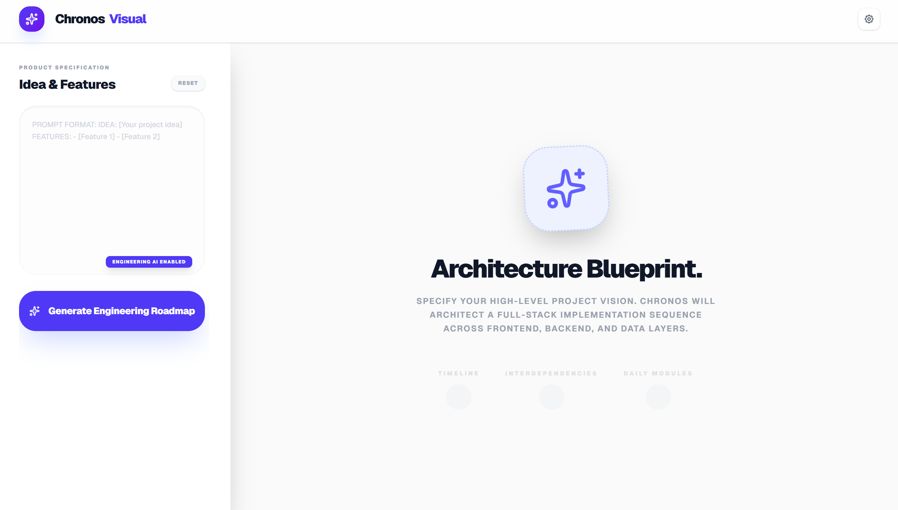

# Chronos Visual - AI-Powered Project Timeline Generator

**Chronos Visual** is an open-source project timeline generator that leverages the power of AI to create detailed, structured project plans from a simple project idea and a list of features. It's designed for developers, project managers, and anyone who wants to quickly create a visual roadmap for their projects.

## About The Project



This project was built to demonstrate the power of generative AI in project planning. By providing a high-level project description, Chronos Visual can generate a complete project timeline, including tasks, dependencies, and a critical path analysis. This allows you to quickly get a sense of the project's scope and complexity, and to identify potential bottlenecks before they become a problem.

The application is built with Next.js and Tailwind CSS, and it uses D3.js for data visualization. It supports multiple AI providers, including Google Gemini, OpenAI ChatGPT, and Anthropic Claude, allowing you to choose the one that best suits your needs.

## Features

*   **AI-Powered Timeline Generation:** Automatically generate a project timeline from a project idea and a list of features.
*   **Multiple AI Providers:** Choose between Google Gemini, OpenAI ChatGPT, and Anthropic Claude.
*   **Interactive Visualizations:** Visualize your project timeline as a Gantt chart, a network graph, or a daily roadmap.
*   **Critical Path Analysis:** Automatically identify the critical path of your project to help you focus on the most important tasks.
*   **Task Details:** Click on any task to view its details, including its duration, dependencies, and phase.
*   **LocalStorage Persistence:** Your project data is saved in your browser's localStorage, so you can pick up where you left off.
*   **Open Source:** Chronos Visual is completely open source and available on GitHub.

## Getting Started

To get a local copy up and running, follow these simple steps.

### Prerequisites

You'll need to have the following software installed on your machine:

*   [Node.js](https://nodejs.org/en/) (v20 or later)
*   [npm](https://www.npmjs.com/)

### Installation

1.  Clone the repo
    ```sh
    git clone https://github.com/anshu0027/project-timeline-generator
    ```
2.  Navigate to the project directory
    ```sh
    cd project-timeline-generator
    ```
3.  Install NPM packages
    ```sh
    npm install
    ```

## Usage

To start using Chronos Visual, you'll need to configure your AI provider.

### Configuration

1.  Create a `.env.local` file in the root of the project.
2.  Add the API keys for the AI providers you want to use. You can get the API keys from the following links:
    *   [Google Gemini](https://aistudio.google.com/app/apikey)
    *   [OpenAI](https://platform.openai.com/api-keys)
    *   [Anthropic Claude](https://console.anthropic.com/dashboard)

    Your `.env.local` file should look like this:

    ```env
    NEXT_PUBLIC_GEMINI_API_KEY=your_gemini_api_key
    OPENAI_API_KEY=your_openai_api_key
    CLAUDE_API_KEY=your_claude_api_key
    ```

    **Note:** You only need to add the API key for the provider you want to use.

### Running the Application

1.  Start the development server
    ```sh
    npm run dev
    ```
2.  Open your browser and navigate to `http://localhost:3000`.

Now you can start generating project timelines!

1.  Enter your project idea and a list of features in the text area on the left.
2.  Select your preferred AI provider from the settings menu in the top right.
3.  Click the "Generate Engineering Roadmap" button.

Your project timeline will be generated and displayed on the right. You can switch between the different views (Roadmap, Gantt, Network) to visualize your project in different ways.

## Contributing

Contributions are what make the open source community such an amazing place to learn, inspire, and create. Any contributions you make are **greatly appreciated**.

If you have a suggestion that would make this better, please fork the repo and create a pull request. You can also simply open an issue with the tag "enhancement".

Don't forget to give the project a star! Thanks again!

1.  Fork the Project
2.  Create your Feature Branch (`git checkout -b feature/AmazingFeature`)
3.  Commit your Changes (`git commit -m 'Add some AmazingFeature'`)
4.  Push to the Branch (`git push origin feature/AmazingFeature`)
5.  Open a Pull Request

## License

Distributed under the MIT License. See [LICENSE](./LICENSE) for more information.